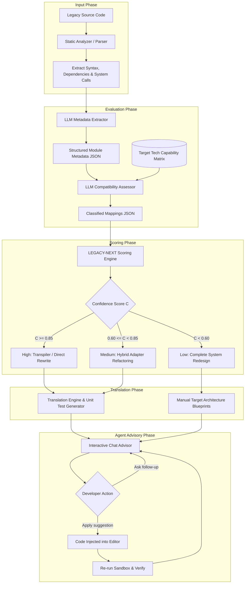
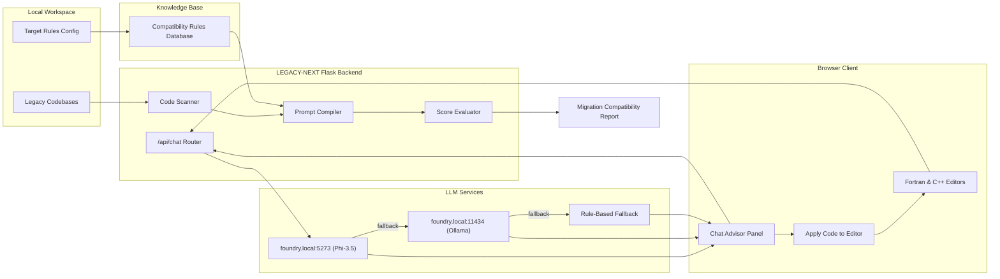
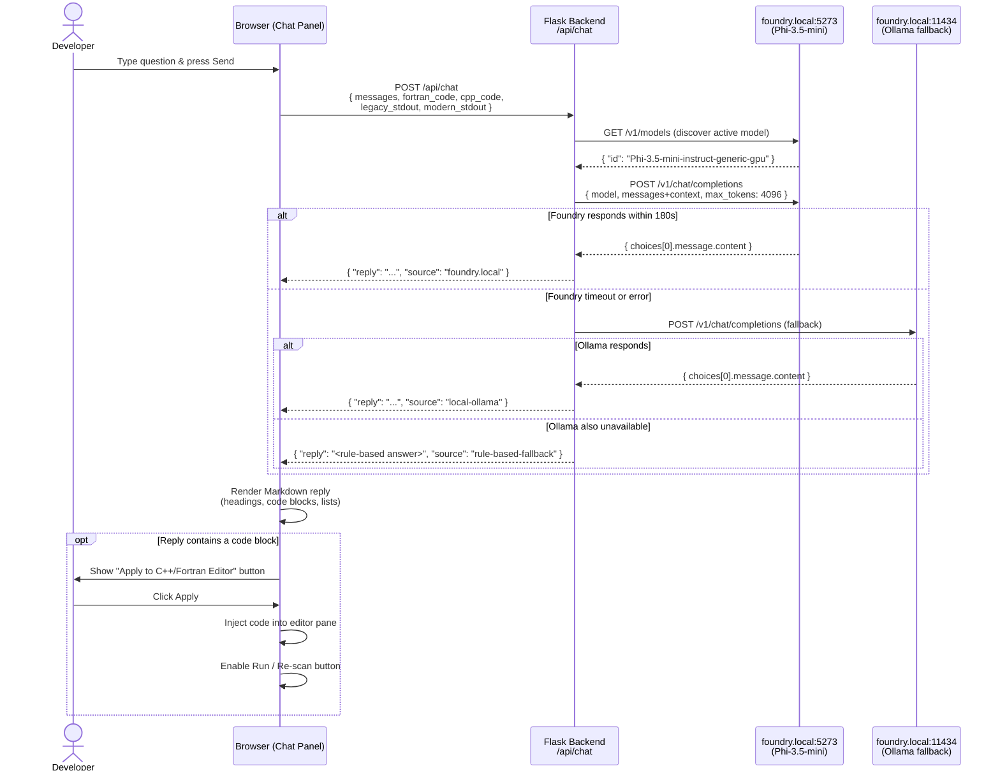

# LEGACY-NEXT: Architecture Diagrams

This document contains visual diagrams mapping out the migration assessment pipeline and the internal architecture of the evaluation agent.

## 1. Migration Assessment Pipeline

This flowchart outlines the progression of source code from ingestion, syntax parsing, and AI-driven capability mapping to score calculation, target code generation, and interactive agent review.

---

## 2. Assessment Agent Architecture

This block diagram represents the logical components of the assessment tool, showing how it orchestrates files, external knowledge systems, prompts, and the scoring system.

---

## 3. Interactive Agent Advisory — Request & Response Flow

This sequence diagram shows the exact flow of a single chat message from the browser to the local LLM and back, including context injection and code-apply confirmation.

