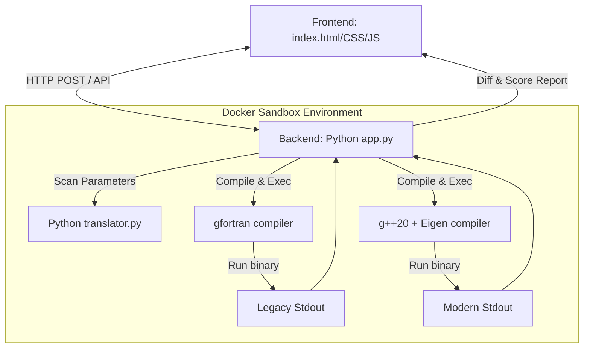

# Implementation Plan: Dockerized Fortran Migration Sandbox

This plan details the architecture and components required to build a Dockerized legacy-to-modern migration test sandbox. It includes a web interface to upload/paste Fortran code, compile and run the legacy binary, dynamically request missing runtime inputs, automatically translate code to C++20 + Eigen, run the modern execution engine, and display a side-by-side mathematical output comparison and evaluation.

---

## Proposed System Architecture



---

## Proposed Changes

We will create the following files to implement the complete sandbox environment:

### 1. Docker Setup
#### [NEW] [Dockerfile](file:///Volumes/superfast/LinkedIn/Classic_Code/Dockerfile)
* Installs a full compilation environment: `gfortran`, `g++`, `libeigen-dev`, `python3`, and python-pip.
* Sets up a non-root environment inside `/app` for sandboxed compilation.
* Copies backend scripts and frontend assets, exposing port `8080`.

### 2. Backend Engine
#### [NEW] [app.py](file:///Volumes/superfast/LinkedIn/Classic_Code/src/app.py)
* A lightweight Flask web server.
* **Endpoints**:
  * `POST /api/analyze`: Parses the uploaded Fortran code using regex to discover inputs (e.g. `PARAMETER` constants, initial value loops) and returns them to the UI so users can override them on-the-fly.
  * `POST /api/run-legacy`: Writes the Fortran source code to a temporary file, inserts user inputs, compiles it using `gfortran`, executes it, and returns the output logs.
  * `POST /api/translate`: Invokes the transpiler to generate C++20 + Eigen code.
  * `POST /api/run-modern`: Compiles the generated C++20 code using `g++ -std=c++20`, runs it, and returns the output logs.
  * `POST /api/compare`: Executes the `evaluator.py` logic on the translation mapping and compares the terminal outputs line-by-line, highlighting any numerical differences or formatting shifts.

#### [NEW] [translator.py](file:///Volumes/superfast/LinkedIn/Classic_Code/src/translator.py)
* A rule-based Python translator that parses standard Fortran 77/90 expressions and replaces them with C++20 equivalents.
* Automatically translates:
  * Variable declarations (`REAL` $\rightarrow$ `double`, `INTEGER` $\rightarrow$ `int`).
  * Shared state (`COMMON /SIMPARAM/` $\rightarrow$ C++ parameter `struct`).
  * 1-indexed matrices (`DIMENSION U(NX, NY)` $\rightarrow$ `Eigen::Matrix<double, ..., ColMajor>`).
  * `DO` loops $\rightarrow$ `for` loops, auto-shifting loop limits and array subscripts by `-1`.
  * `WRITE` and `FORMAT` blocks $\rightarrow$ C++20 `std::format` syntax.

### 3. Frontend Web Interface
We will build a responsive single-page web app with a state-of-the-art dark mode design.

#### [NEW] [index.html](file:///Volumes/superfast/LinkedIn/Classic_Code/src/static/index.html)
* Provides a layout with a header, a Fortran code editor (side pane), input controls, and an output comparison panel (center/right pane).
* Uses semantic elements with clean IDs.

#### [NEW] [styles.css](file:///Volumes/superfast/LinkedIn/Classic_Code/src/static/styles.css)
* Custom styling using HSL color variables (dark slate backgrounds, cyan highlights, neon green for successes, red for gaps).
* Implements glassmorphism (`backdrop-filter`), CSS variables, custom card grids, and micro-animations on interactive hover states.

#### [NEW] [script.js](file:///Volumes/superfast/LinkedIn/Classic_Code/src/static/script.js)
* Manages client-side operations: uploading sample programs, scanning for input variables, compiling/running, displaying diffs, and rendering the score report.

---

## Verification Plan

### Automated Build & Test
1. Build the Docker container locally:
   ```bash
   docker build -t legacy-next-sandbox .
   ```
2. Run the sandbox container:
   ```bash
   docker run -p 8080:8080 legacy-next-sandbox
   ```
3. Open `http://localhost:8080` in your web browser.

### Manual Verification Flow
1. **Load Sample Code**: Click "Load FLUIDSIM.f Sample". The Fortran code will appear in the editor.
2. **Scan Variables**: The app will automatically analyze the code and show input fields for grid sizes (`NX`, `NY`), time steps (`DT`), and pressure (`P_init`) on the screen.
3. **Modify & Run Legacy**: Adjust the values (e.g. change grid sizes to 12x12 or steps to 10) and click **"Run Legacy Fortran"**. The legacy stdout outputs will print in the left log window.
4. **Translate**: Click **"Transpile to C++"**. The generated C++20 source will render in the middle panel.
5. **Run Modern & Compare**: Click **"Run Modern C++ & Compare"**. The C++ output logs will appear in the right log window, highlighting any difference in midpoint velocity values, and a detailed summary of migration confidence will display.
